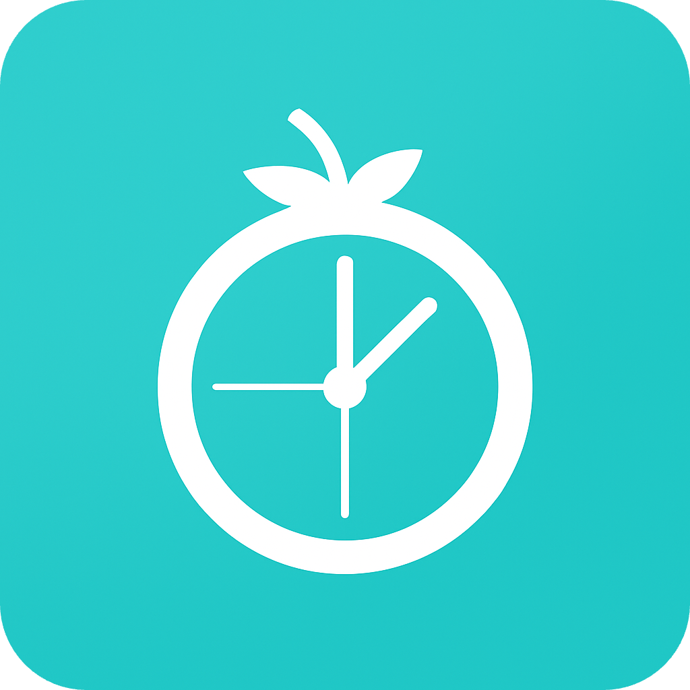
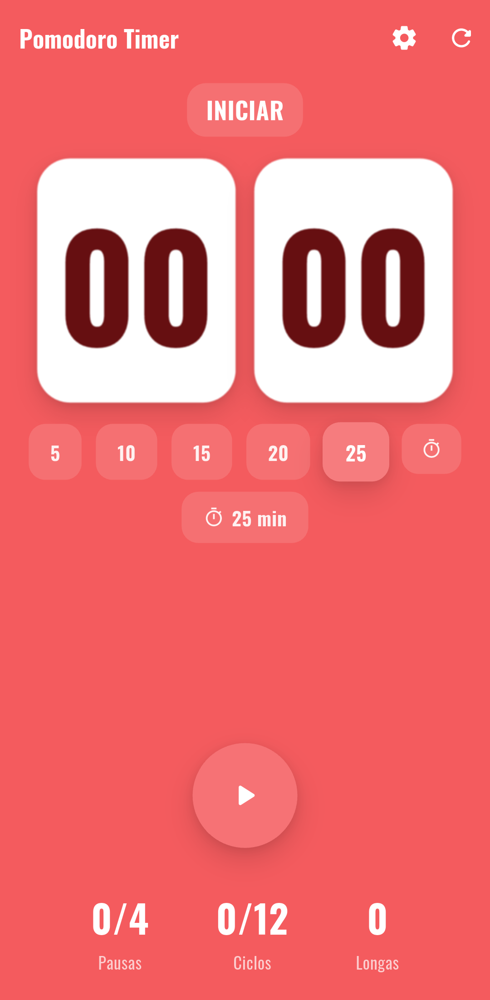
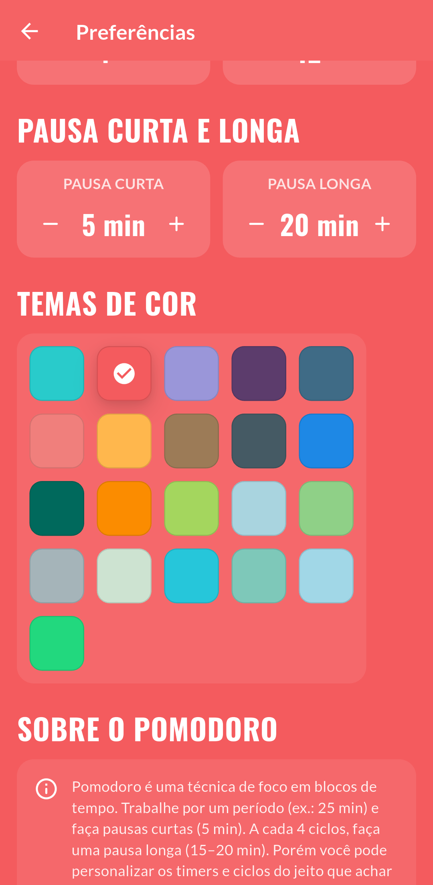
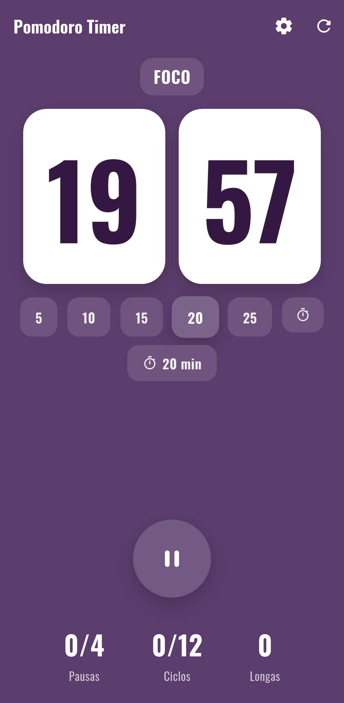
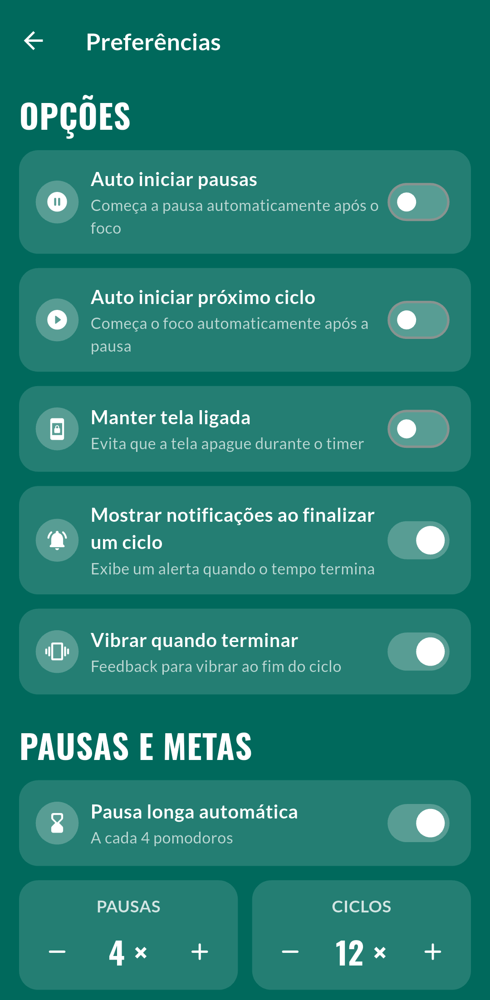

  

# Pomodoro Timer (Flutter)

Aplicativo de **timer Pomodoro** simples, acessível e personalizável, desenvolvido em **Flutter** com **Riverpod**. Foco em produtividade, clareza visual e baixo consumo de bateria.

  

 

### Destaques

* ⏱️ **Fluxo Pomodoro completo**: foco, pequenas pausas, longas pausas e ciclos.
* 🎚️ **Tempos personalizáveis** e número de ciclos por sessão.
* 🔔 **Notificações/Vibração** ao fim de cada etapa (configurável).
* 📴 **Manter tela ligada (opcional)** durante o ciclo de foco.
* 📱 **Responsivo & Acessível** (SafeAreas, contrastes, textos escaláveis).

 

### Screenshots

| Home | Temas | Focus | Preferências |
|---|---|---|---|
|  |  |  |  |

 

### Permissões & Segurança de Dados

* **Android 13+**: `POST_NOTIFICATIONS` (para alertas ao fim de cada etapa).
* **Geral**: `VIBRATE`, `WAKE_LOCK` (se usar wakelock), `FOREGROUND_SERVICE` (se houver serviço de contagem).

**Coleta de dados**: o app **não coleta dados pessoais**; preferências ficam **somente no dispositivo**.

* Política de Privacidade: [`PRIVACY.md`](PRIVACY.md)

 

### Changelog (Resumo)

**Legado / 2º semestre de 2022**

* Aplicação desenvolvida em Flutter, inicialmente para a avaliação N1 da matéria de Desenvolvimento de Dispositivos Móveis do curso de Engenharia de Software no Centro Universitário Católica de Santa Catarina em Jaraguá do Sul.

**Reestruturação ampla / 2º semestre de 2025**

* Reestruturação do projeto (pastas) com migração Provider → Riverpod e atualização do Flutter/Dart.
* Ajustes de build e compatibilidade para Android e iOS.
* Organização de distribuição: APKs saem do repositório e passam a ficar em Releases.
* Licenciamento: confirmação/atualização para MIT.
* Higiene do repositório: remoção de dependências/arquivos não utilizados e limpeza geral.
* Fluxo Pomodoro completo e personalizado: foco, pausas curtas e longas e com ciclos.
* Novos temas + paleta de cores; preferências persistentes (tema, notificações, tela ligada, etc.).
* Acessibilidade: melhor contraste, textos escaláveis e ajustes na tela inicial.
* Polimento de UI e novos ícones; renomeação do app/pacote.

 

### Caso Deseje Contribuir

1. Faça um fork e crie sua branch: `feat/minha-feature`
2. Rode os testes e `flutter analyze`
3. Abra um PR descrevendo sua mudança

> Estilo de commits sugerido: [Conventional Commits](https://www.conventionalcommits.org/)

* Guia de contribuição: [`CONTRIBUTING.md`](CONTRIBUTING.md)
* Código de Conduta: [`CODE_OF_CONDUCT.md`](CODE_OF_CONDUCT.md)

 

### FAQ

* **Por que o timer não notifica?** No Android 13+ é preciso permitir **Notificações** nas configurações do app.
* **O app coleta meus dados?** Não. Apenas preferências locais.
* **Por que não há APK no repositório?** Mantemos binários em **Releases** (boa prática de repositórios).

 

### Licença

Este projeto é licenciado sob a **MIT** – veja [`LICENSE`](LICENSE) para detalhes.